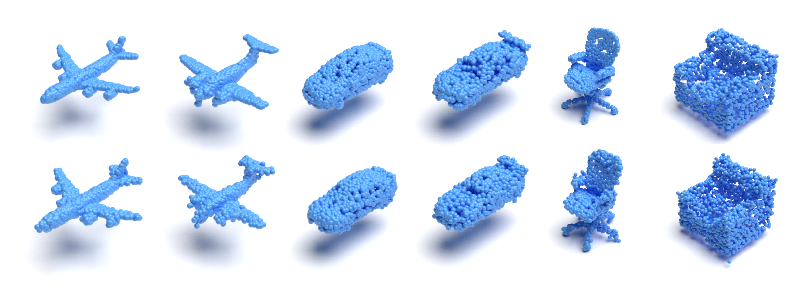

# Representing Point Clouds with Generative Conditional Invertible Flow Networks

This is a PyTorch implementation of the paper:

<!--[Representing Point Clouds with Generative Conditional Invertible Flow Networks](arXiv link) <br>-->
Representing Point Clouds with Generative Conditional Invertible Flow Networks <br>
Michał Stypułkowski, Kacper Kania, Maciej Zamorski, Maciej Zięba, Tomasz Trzciński, Jan Chorowski <br>
Preprint. Under review.

## Introduction
This paper focuses on a novel generative approach for 3D point clouds that makes use of invertible flow-based models. The main idea of the method is to treat a point cloud as a probability density in 3D space that is modeled using a cloud-specific neural network. To capture the similarity between point clouds we rely on parameter sharing among networks, with each cloud having only a small embedding vector that defines it. We use invertible flows networks to generate the individual point clouds, and to regularize the embedding vectors. We evaluate the generative capabilities of the model both in qualitative and quantitative manner.

## Requirements
Stored in `requirements.txt`.

## Training
Run the training process with:

`python experiments/train/train_model.py --config configs/cif_train.yaml`

## Evaluation
Run `python experiments/test/EXPERIMENT_NAME.py --config configs/cif_eval.yaml`,
where `EXPERIMENT_NAME` can be on of the following:

1. `train_reconstruction` to reconstruct the training set
2. `test_reconstruction` to reconstruct the test set
3. `sampling` to sample new objects
4. `interpolation` to interpolate between shapes in latent space
5. `common_rare` to find most casual and unique point clouds in the dataset
6. `metrics_eval` to evaluate performance of the model. Please note that it calculates only Coverage and MMD. For full evaluation we used [PointFlow's script](https://github.com/stevenygd/PointFlow). In addition, you need to install `pytorch_structural_losses` from [here](https://github.com/stevenygd/PointFlow/tree/master/metrics/pytorch_structural_losses).  

### Rendering
1. Install docker container of [Mitsuba Renderer](https://github.com/kacperkan/mitsuba-flask-service) as:
```bash
$ docker build -t mitsuba <path-to-downloaded-repository-of-mitsuba>
$ docker run -it -p 8000:8000 --name mitsuba mitsuba:latest 
```
This will start a service for rendering purposes.

2. Run:
```bash
$ python utils/visualize_points.py \
    <input-file> \
    <output-folder-or-file> \
    [--torch] \
    [--rotated] \
    [--batch] \
    [--port <port>]
```
where:
- `<input-file>` is a path to either `*.npy` file or a file that can be depickled by `torch`. The file contains points as `N x 3` matrix or `B x N x 3` where `B` is a batch size and `N` - number of points. If the file has 3 dimensions, you need to use `--batch` as well.
- `<output-folder-or-file>` is a directory where renders from a batch should saved as `1.png, 2.png, ..., <B>.png`. If `--batch` is not used then it should be a file path, for example: `~/output/img.png`.
- `--torch` optional flag pointing that the `<input-file>` should be depickled with `torch.load`
- `--rotated` optional flag that rotates point clouds prior rendering. It should be used in cases where the rendered shape is rotated.
- `--port <port>` is a port for the mitsuba service if it was run with other port than `8000`.

<!--## Citation
```
@article{stypulkowski2019cif,
  title={Conditional Invertible Flow for Point Cloud Generation},
  author={Stypu{\l}kowski, Micha{\l} and Zamorski, Maciej and Zi{\k{e}}ba, Maciej and Chorowski, Jan},
  journal={arXiv},
  year={2019}
}
```
